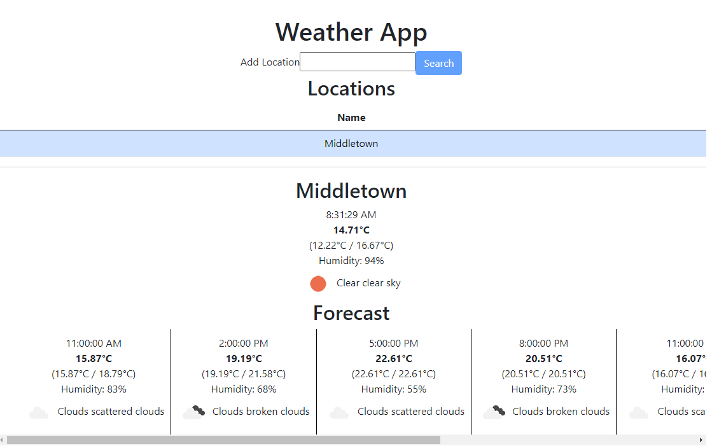

# Weather App

I created a React project by using command npx create-react-app weather_app --tamplate typescript.

I got an API key from https://openweathermap.org/api and I created an env file and placed my API key there .

